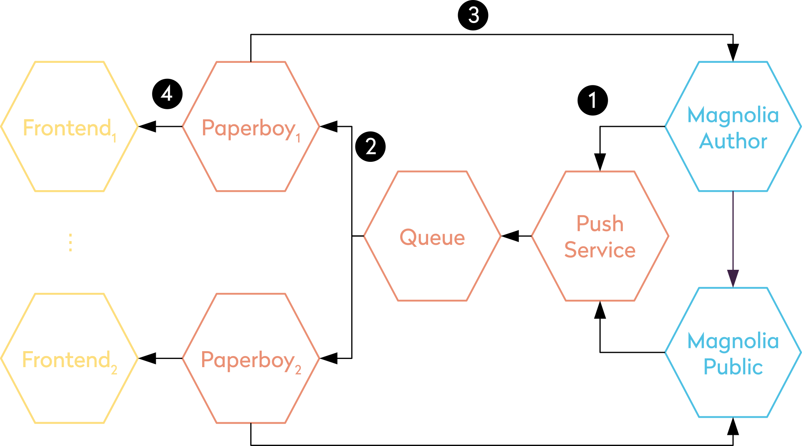
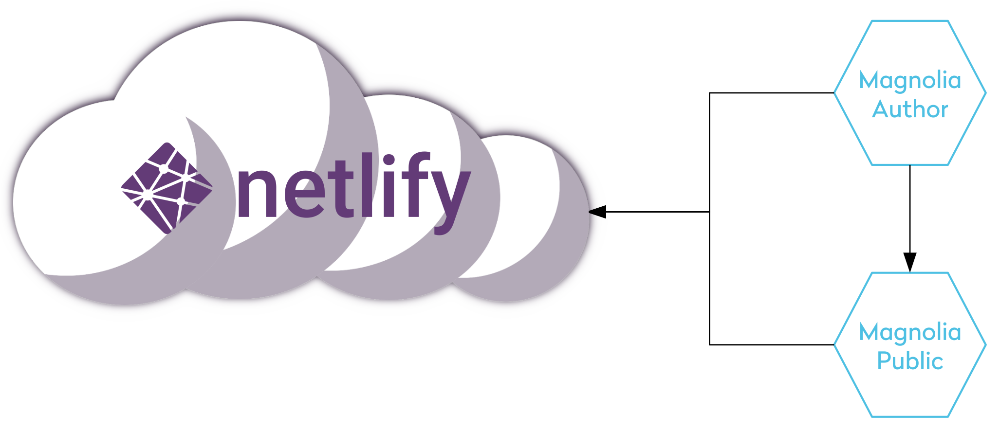

# Paperboy

A middleware written in TypeScript to connect different CMS with your delivery layer and to notify it of content changes.

## Overview

To leverage the flexibility of a content management system while having the performance of a static site one needs to decouple the delivery layer from the CMS. Paperboy acts as a broker between these two layers by informing the delivery layer of content changes. To support the use-case of multiple frontend servers Paperboy multiplexes events via a Queue. Using the [Magnolia CMS](https://www.magnolia-cms.com), the complete setup looks like the following:



1. This setup works by add a Magnolia module to both
   instances, which listens for content changes and publishes
   details of those changes to a Webhook which publishes a message to a NATS server
2. A client-side library then subscribes to this queue
3. Finally it will execute an arbitrary command to trigger
   the actual rebuild of the frontend

In case we don't want to operate the delivery tier ourselves and instead use a CDN like [Netlify](https://www.netlify.com) you can use the Magnolia Module to publish directly to a webhook by the CDN provider:



### Components

For the content management tier we provide two submodules which together with a queue handle the propagation of content change events:

1. [Paperboy push service](./paperboy-push-service): A small HTTP service that can be used as a webhook.

The subscriber part of this system is currently comprised of two submodules in this repository:

1. [Paperboy Core](./paperboy-core): The core library which handles all generic configuration and knows how to execute the commands to trigger rebuilds.
2. [Paperboy CLI](./paperboy-cli): A simple CLI to ease usage and setup

## Demo

Run the following command to start a queue, push service and a simple 'frontend':

```bash
$ docker-compose up
```

When all services are up an running execute the follow command to send a message via the push service:

```bash
$ curl -X POST \
  http://localhost:8080/ \
  -H 'Authorization: Bearer supersecret' \
  -H 'Content-Type: application/x-www-form-urlencoded' \
  -d 'payload=%7B%22foo%22%3A%22bar%22%7D&source=foo'
```

### Set-Up

To use Paperboy in your Frontend you can simply install the CLI globally via:

```bash
$ npm i -g @neoskop/paperboy-cli
```

In case that you are writing the frontend with JavaScript you can also install the CLI locally in your project:

```
$ npm i --save-dev @neoskop/paperboy-cli
```

Start the push service and a NATS server by running the following command in the root folder of this repository:

```bash
$ docker-compose up
```

To configure the frontend, create a file called `paperboy.config.json` with the following contents:

```json
{
  "queue": {
    "uri": "nats://queue:4222"
  },
  "command": "npm start"
}
```

Finally change to the frontend directory and run:

```bash
$ paperboy start
```

## License

This project is under the terms of the Apache License, Version 2.0. A [copy of this license](LICENSE) is included with the sources.
