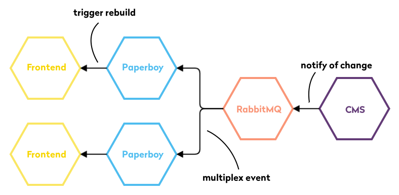

# Paperboy

A middleware written in TypeScript to connect different CMS with your delivery layer and to notify it of content changes.

## Overview

To leverage the flexibility of a content management system while having the performance of a static site one needs to decouple the delivery layer from the CMS. Paperboy acts as a broker between these two layer by informing the delivery layer of content changes. To support the use-case of multiple frontend servers Paperboy multiplexes events via RabbitMQ. The usual setup looks something like the following: 

For this setup to work we need to have a component pushing events to the queue and a component to connect to the queue as a subscriber. There are currently two ways to push events via two different submodules:

1. [Paperboy push service](./paperboy-push-service): A small HTTP service that can be used as a webhook.
2. [Paperboy Magnolia module](./paperboy-magolia-module): A module that integrates directly into Magnolia and sends events whenever a change in a watched workspace occurs.

The subscriber part of this system is currently comprised of three submodules in this repository:

1. [Paperboy Core](./paperboy-core): The core library which handles all generic configuration and knows how to execute the commands to trigger rebuilds.
2. [Paperboy CLI](./paperboy-cli): A simple CLI to ease usage and setup
3. [Paperboy Magnolia Source](./paperboy-magnolia-source): A plug-in for the core which can fetch and transpose JSON data obtained from Magnolia.

## Quickstart

_TODO_

## Usage

_TODO_

## License

This project is under the terms of the Apache License, Version 2.0. A [copy of this license](LICENSE) is included with the sources.